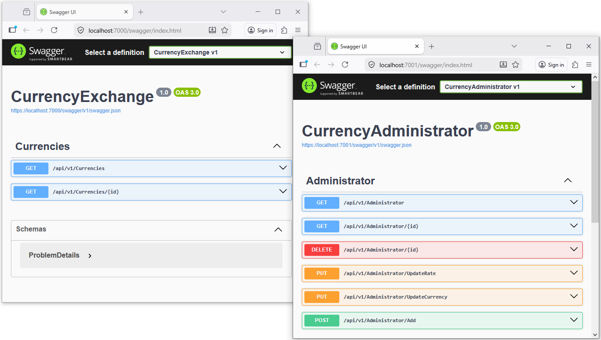
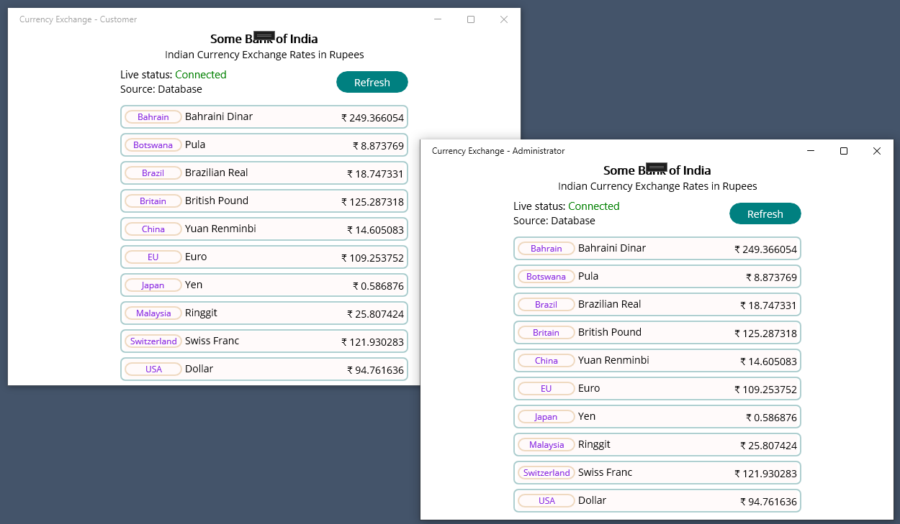
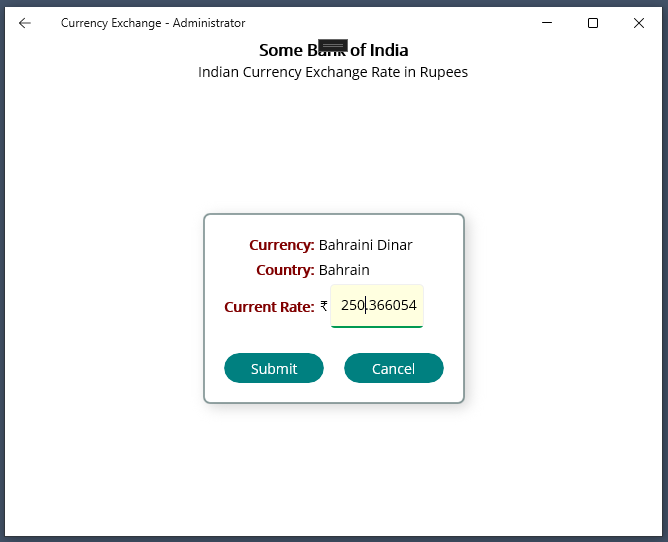
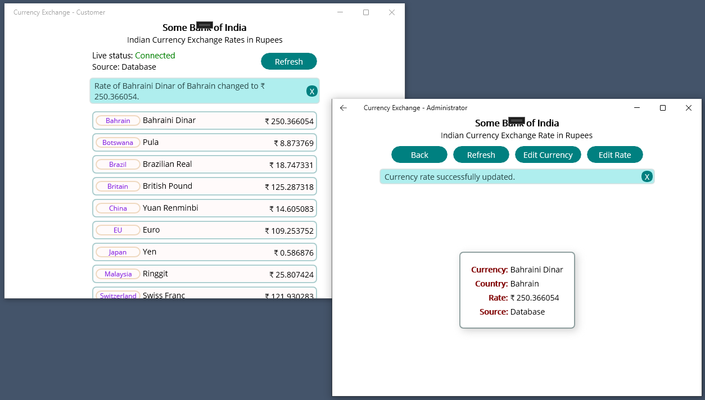
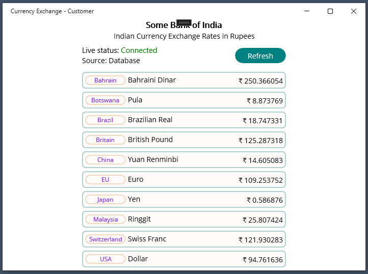
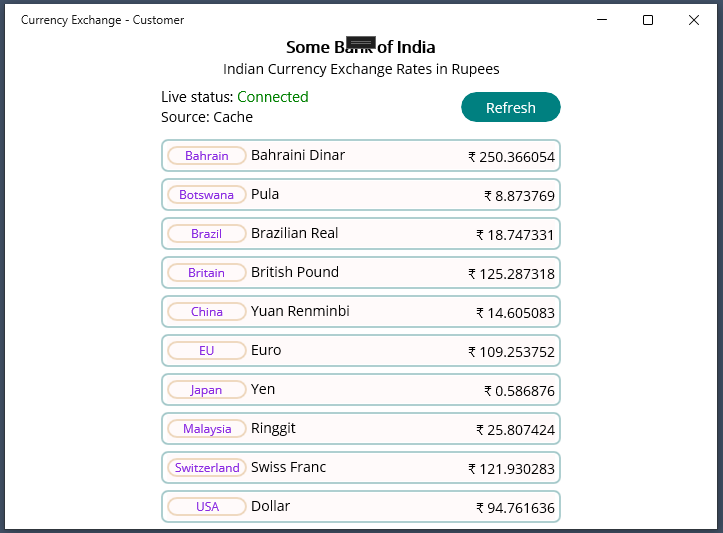
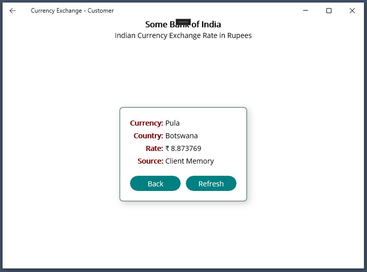
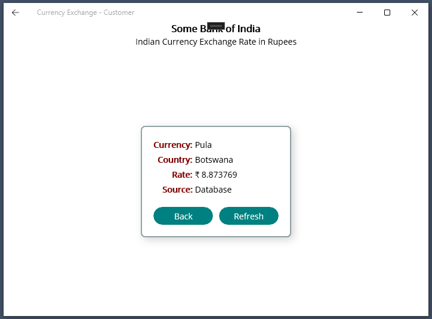
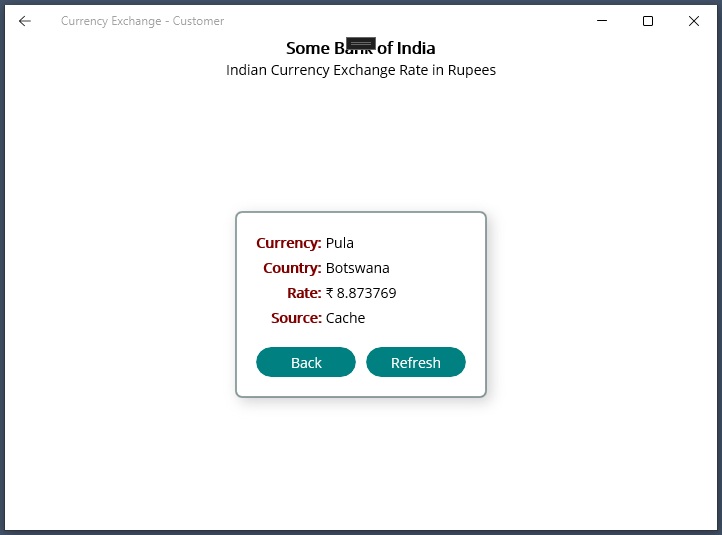

# Currency Exchange System
A real-time, scalable currency exchange platform built using ASP.NET Core, .NET MAUI, RabbitMQ, and SQL Server, designed to solve cache inconsistency in distributed systems.

## Problem Statement
Frequent database hits for unchanged currency data lead to:
- Performance overhead
- Increased latency
- Poor scalability
- At the same time, caching introduces: Stale data issues when currency values change

## Solution
This project implements:
-	Server-side caching to reduce database load
-	Event-driven cache invalidation using RabbitMQ
-	Real-time client updates using SignalR

## Architecture Overview
1.	Administration Service (ASP.NET Core API)
    *	Performs CRUD operations on currencies
2.	Customer Service (ASP.NET Core API)
    *	Serves currency data to users
3.	Shared Repository Layer
    *	Built using Entity Framework Core
4.	Message Broker
    *	RabbitMQ (AMQP-based communication)
5.  Frontend
    *  .NET MAUI apps (Administration + Customer)

## System Workflow
1.	Client requests currency data
2.	Server:
    +	Fetches from cache (if available) Otherwise queries SQL Server and caches result
3.	Administrator updates currency
    +	System:
        *   Invalidates cache
        *   Publishes event via RabbitMQ
4.	Customer service:
    +	Receives message
    +	Pushes real-time update via SignalR

## Tech Stack
* __Backend:__ ASP.NET Core Web API
* __Frontend:__ .NET MAUI
* __Database:__ SQL Server
* __ORM:__ Entity Framework Core
* __Messaging:__ RabbitMQ (AMQP)
* __Real-Time Communication:__ SignalR
* __Caching:__ In-Memory Cache
* __Containerization:__ Docker (RabbitMQ)

## Key Features
* Distributed cache handling with invalidation
* Real-time updates using SignalR
* Event-driven architecture using RabbitMQ
* Clean separation of Admin & Customer services 
* EF Core-based data access layer
* Docker support for RabbitMQ

## Setup Instructions
1.	Clone Repositories
    *	Backend
        -   git clone https://github.com/pramod9503/CurrencyExchangeBackend.git
	*   Frontend
        -   git clone https://github.com/pramod9503/CurrencyExchangeFrontend.git 
2.	Setup RabbitMQ (Docker Recommended)
    * After running docker, type following commands in the Powershell to pull the __rabbitmq:3-management__ image from the Docker repository. 

        `docker pull rabbitmq:3-management`

    *   Type the following command to run the __rabbitmq:3-management__ container with name __rabbitmq-currency__.

            `docker run -d \
            --hostname rabbitmq-host \
            --name rabbitmq-currency \
            -p 5672:5672 \
            -p 15672:15672 \
            -v rabbitmq_data:/var/lib/rabbitmq \
            rabbitmq:3-management`

3.	Access UI: 
            http://localhost:15672/
            (Default Username/Password: guest / guest)

4.	Import Queue Configuration
    *	Open RabbitMQ UI
    *	Import RabbitMq-Configuration.json file found in the __~CurrencyExchangeLive\Backend\CurrencyAdministrator__ folder.
        - This creates:
            + Exchange: currency_update_exchange
            + Queue: currency_exchange.queue

5.	Setup Database
    *   Run the following command in Powershell from the __~CurrencyExchangeLive\Backend\CurrencyAdministrator__ folder.

        `dotnet ef database update`

        This will create 'CurrenciesDb' SQL Server database.

6.	Run Backend
    * Configure both projects CurrencyAdministrator and CurrencyExchange to run simultaneously.
    *   Runs:
        -   Administration API
        -   Customer API
        -   Opens Swagger for both services

7.	Run Frontend (.NET MAUI)
    * Configure both projects CurrencyExchangeAdministrator and CurrencyExchangeCustomer to run simultaneously.
    *   Runs:
        -   Administration App
        -   Customer App

## Real-Time Behavior
*	Admin updates currency

*	Cache invalidated instantly

*	RabbitMQ publishes event

*	Customer app updates live without refresh

## Concepts Demonstrated
*	Distributed Systems Design
*	Cache Invalidation Strategy
*	Event-Driven Architecture
*	Message Queues (AMQP)
*	Real-Time Communication
*	Microservices Communication

## Screenshots
- Swagger screenshot backend.

- Opening screenshot frontend .NET MAUI.

- Changing the currency rate by Administrator.

- Live update in currency rate and cache invalidation after the currency rate changed by the Administrator.

- __Source: Database__ when the currencies are fetched for the first time. 

- __Source: Cache__ when the currencies are fetched subsequent times by clicking the __Refresh__ button.

- Currency __Source: Client Memory__ when the currency is accessed for the first time from currencies list.

- Currency __Source: Database__ when the __Refresh__ button is clicked and currency accessed for the first time.

- Currency __Source: Cache__ when the __Refresh__ button is clicked and currency accessed for the subsequent times until the currencies have not changed.

